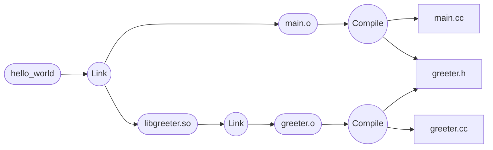

# An Introduction to Bazel

This document provides a summary of the concepts and benefits of the Bazel build system, based on the presentation "A very short intro to Bazel." It's aimed at software engineers, particularly those with experience using tools like `make`.

## Core Philosophy: Design Principles

Bazel's design is guided by three fundamental principles that address common problems in software development, such as the "it works on my machine" phenomenon.

### Hermeticity

Builds are **hermetic**, meaning they are self-contained and isolated from the host system. Every tool (like compilers and linkers) and every dependency (like libraries and headers) must be explicitly declared for the build to access them. This ensures that builds are not affected by the specific software installed on a local machine, leading to consistent behavior across different environments.

### Reproducibility

A direct result of hermeticity is **reproducibility**. Given the exact same source code and dependency graph, Bazel guarantees that the output of the build will be bit-for-bit identical, every single time. This eliminates a whole class of build issues that arise from subtle differences in environments.

### Scalability

Bazel was built at Google to handle a massive monorepo. Its architecture is designed for scalability through:

- **Parallelism**: By understanding the entire dependency graph, Bazel can execute independent build and test actions in parallel.
- **Aggressive Caching**: Bazel caches the output of every action. If the inputs to an action haven't changed, the output is retrieved from the cache instead of being rebuilt.
- **Remote Execution and Caching**: Bazel supports a shared, remote cache for an entire team or organization. It can also distribute build actions across a cluster of machines using its Remote Execution API, dramatically speeding up builds for large projects.

## Key Concepts

### Workspaces, Packages, Targets, and Labels

Bazel organizes code using a few key structural elements:

- **Workspace**: The root of your project, identified by a `WORKSPACE` file.
- **Package**: A directory within the workspace that contains a `BUILD` file.
- **Target**: An object that Bazel can build, defined within a `BUILD` file. A target can be a source file or a rule.
- **Label**: A unique identifier for a target. For example, `//src/server:server_binary` refers to the `server_binary` target in the `src/server` directory of the workspace root (`//`).

### Rules

A **rule** is like a function that tells Bazel *how* to build a set of output targets from a set of input dependencies. For any given rule, you must:

1. **Declare Dependencies**: Specify the labels of other targets required as inputs.
2. **Define Actions**: List the commands to run (e.g., a compiler command) to produce the outputs.
3. **Declare Outputs**: List the files the rule will generate.

Rules are written in **Starlark**, a deterministic dialect of Python designed for configuration. This allows Bazel's build logic to be highly extensible and customizable.

### A Concrete Example: C++

Consider a simple C++ project with a library and a binary that uses it.

**`//src/greeter/BUILD`**

```python
cc_library(
    name = "greeter",
    srcs = ["greeter.cc"],
    hdrs = ["greeter.h"],
)
```

**`//src/main/BUILD`**

```python
cc_binary(
    name = "hello_world",
    srcs = ["main.cc"],
    deps = [
        "//src/greeter:greeter",
    ],
)
```

Here, the `cc_binary` rule for `hello_world` explicitly declares a dependency (`deps`) on the `cc_library` target `greeter`. This tells Bazel it must build the `greeter` library before it can build the `hello_world` binary.

## Reducing Boilerplate: Macros

Macros are a simple way to bundle multiple rule declarations into a single, reusable function. They are useful for enforcing consistency and reducing repetition in `BUILD` files.

### Macro Definition

Macros are also written in Starlark. For example, a macro could define a C++ library and a test for each of its source files.

```python
def cc_lib_and_test(name, srcs, hdrs, deps):
  cc_library(
    name = name,
    srcs = srcs,
    hdrs = hdrs,
    deps = deps,
  )
  for s in srcs:
    basename = s[:-3]  # drop .cc
    cc_test(
      name = name + "_" + basename + "_test",
      srcs = [basename + "_test.cc"],
      deps = ":" + name,
    )
```

*Note: Unlike rules, macros cannot inspect files, so this example macro cannot check if the `_test.cc` files actually exist.*

### Macro Usage

At the call site, a macro looks identical to a rule, providing a clean abstraction for the user.

```python
cc_lib_and_test(
  name = "my_lib",
  srcs = ["a.cc", "b.cc"],
  hdrs = ["mylib.h"],
)
```

This would generate the `my_lib` target as well as `my_lib_a_test` and `my_lib_b_test` targets.

### A Note on Macro Errors

Because macros are expanded by Bazel before analysis, error messages may refer to targets that are not explicitly defined in the `BUILD` file. If you encounter an error for a target like `//path:my_lib_b_test`, look for a macro call (`my_lib`) that could have generated it.

## The Magic Behind Bazel

### Sandboxing and Explicit Dependencies

Every action (e.g., a compiler call) is executed in a **sandbox**—a restricted environment that contains only the declared inputs, dependencies, and necessary tools. The action is forbidden from accessing any other files on the system. This strict enforcement of hermeticity means that **all dependencies must be explicitly declared**. Forgetting to declare a dependency (like a header file) will cause the build to fail reliably.

### The Dependency Graph

By analyzing all the `deps` attributes across all `BUILD` files, Bazel constructs a complete Directed Acyclic Graph (DAG) of the entire project. This graph allows Bazel to understand the relationships between all targets and plan an optimal, parallel build execution.



### Aggressive and Shareable Caching

Bazel's performance comes from its aggressive caching strategy. Before executing any action, Bazel calculates a hash based on all of its inputs (source files, dependencies, compiler flags, etc.). If this hash is found in the cache, Bazel simply retrieves the action's outputs from the cache, skipping the execution entirely. This cache can be on-disk for an individual developer or shared on a remote server for an entire team.

## Basic Usage Cheatsheet

### Common Commands

- **Build a target**: `bazel build //path:target_name`
- **Run a test**: `bazel test //path:target_name`

### Inside `BUILD` files

- **Import rules**: Use the `load` statement to import rules from `.bzl` files.

    ```python
    load("@rules_cc//cc:cc_library.bzl", "cc_library")
    ```

- **Common Rules**: Most languages have a standard set of rules, such as `go_library`, `go_binary`, `py_library`, etc.
- **Common Attributes**: Rules typically require a `name` and `srcs` (source files), and often use `deps` (dependencies) and `data` (non-source data files).
