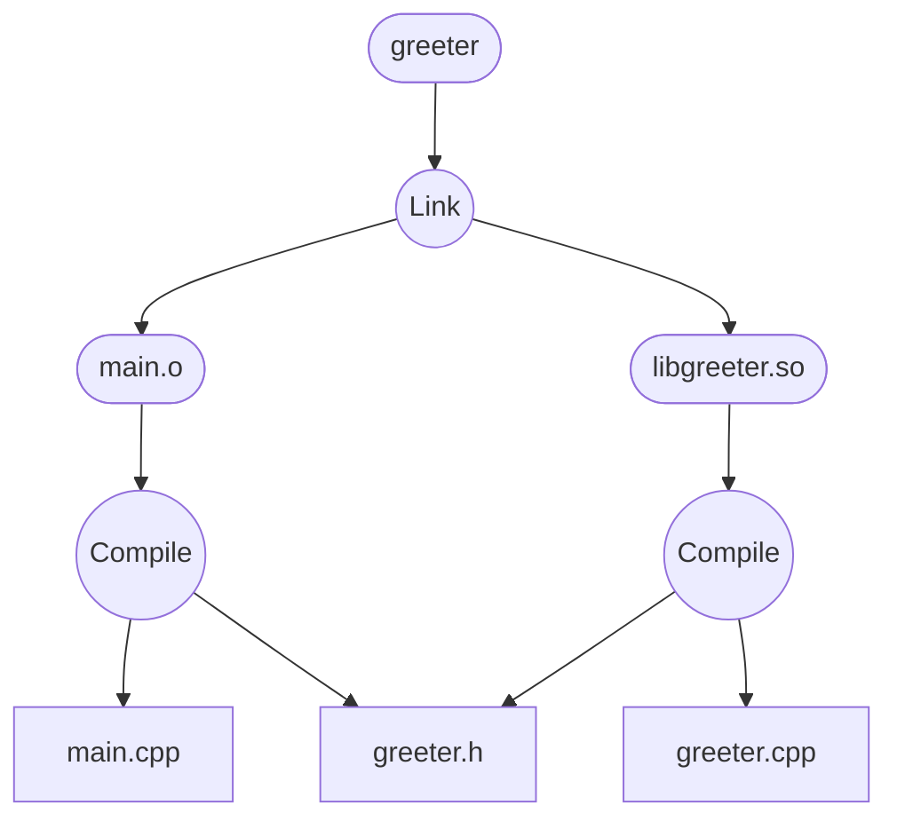

# A very short intro to Bazel

A short tour for engineers who have wrangled `make` before.

<div class="pt-12">
  <span class="px-2 py-1 rounded">July 4, 2025</span>
</div>

<!--
Welcome everyone. Today, we're going to talk about Bazel. If you've ever spent hours debugging a complex Makefile or wondered why a clean build fixes a problem, you're in the right place. We'll explore how Bazel approaches building software and why it's so powerful, especially for large-scale projects.
-->

---

# Core Philosophy: Design Principles

Bazel is built on a foundation of three key principles:

- **Hermeticity**: Builds are self-contained. They don't depend on services or libraries on the host machine that aren't explicitly declared. This ensures that if it builds on your machine, it builds everywhere.

- **Reproducibility**: Given the same source code and dependencies, Bazel guarantees the same output every single time. No more "works on my machine" mysteries.

- **Scalability**: Bazel is designed to handle massive monorepos with millions of files and complex dependency trees. It does this through parallelism and aggressive caching.
  - Additionally bazel supports remote shared cache and remote building on a build cluster via the Remote Execution API.

<!--
This is the "why" of Bazel.
Hermeticity is like building in a cleanroom. You bring in only the tools and materials you've listed, nothing else.
Reproducibility is the direct result of hermeticity.
And scalability is why companies like Google can build their entire codebase from scratch every day. The caching is so effective that most engineers only build a tiny fraction of the code.
A fun fact: The name Bazel is an anagram of "Blaze", which was its internal name at Google. They had to change it for legal reasons.
-->

---

# Key Terminology: Targets & Labels

Everything in Bazel is organized around **targets**. A target is an object that Bazel can build.

- A **file** (e.g., `main.cpp`)
- A **rule** (e.g., `cc_binary`, which creates an executable from source files)

Every target has a unique identifier called a **label**.

```
//path/to/package:target_name
```

- `//`: The root of your workspace.
- `path/to/package`: The directory containing the `BUILD` file.
- `:`: Separates the package path from the target name.
- `target_name`: The name of the target defined in the `BUILD` file or an output.

Example: `//src/server:server_binary`

<!--
Think of targets as the "nouns" of the Bazel world. They are the things we want to create. Labels are how we refer to those nouns. If you see a path-like string starting with `//` in a BUILD file, it's a label pointing to a target.
-->

---

# Key Terminology: Rules

A **rule** is the "verb" of Bazel. It tells Bazel *how* to build a target.

The job of a rule is to:
1.  **Declare Outputs**: What file(s) will this rule create? (e.g., `my_program.o`, `my_program`)
2.  **Define Actions**: What commands should be run to connect inputs to outputs? (e.g., `g++ -c ...`)
3.  **Declare Dependencies**: What other targets are needed as inputs? This builds the dependency graph.

Most rules today are written in **Starlark**, a dialect of Python. This includes the standard C++ rules!

<!--
Rules are the core of Bazel's logic. They are functions that produce actions. When you call a rule, you're not running a command directly. You're telling Bazel, "When you need to build this target, here are the instructions." This deferred execution is key to how Bazel can plan the entire build. The fact that even C++ rules are in Starlark is a testament to Bazel's extensibility.
-->

---

# Rules: A C++ Example

Here's how you'd use the `cc_binary` and `cc_library` rules.

`//src/greeter/BUILD`
```python
cc_library(
    name = "greeter",
    srcs = ["greeter.cpp"],
    hdrs = ["greeter.h"],
)
```

`//src/main/BUILD`
```python
cc_binary(
    name = "hello_world",
    srcs = ["main.cpp"],
    deps = [
        "//src/greeter:greeter",
    ],
)
```

Here, the `hello_world` target *depends* on the `greeter` target. Bazel knows it must build `greeter` first.

<!--
This should look familiar. It's just a structured way of declaring what we would have written in a Makefile.
The `cc_library` rule compiles `greeter.cpp` and makes `greeter.h` available to other targets.
The `cc_binary` rule compiles `main.cpp` and links it against the `greeter` library. The `deps` attribute is how we build the dependency graph. We are explicitly stating the connection between these two components.
-->

---

# The Magic: Sandboxing

This is where Bazel differs most from `make`.

- Every **action** (like a compiler call) runs in a restricted **sandbox**.
- The sandbox contains *only* the inputs you explicitly declared and the tools needed (like the compiler).
- The action **cannot** access any other files on your system.

**Implication**: All dependencies *must* be explicit.
- This can be tedious, but it's the price of hermeticity.
- If you forget a dependency (e.g., a header file), the build fails. You can't lie!
- This is why you can't rely on the compiler to generate dependencies (`-MMD` flag in GCC/Clang). The compiler can't see the files that aren't in the sandbox!

<!--
Sandboxing is the secret sauce. It's a strict but fair system. With `make`, a compiler might happily find a header file in `/usr/include`. In Bazel, unless that header is explicitly declared as a dependency, the sandbox won't contain it, and the compiler will fail with "file not found". This forces us to be honest about our dependencies, which is crucial for reproducibility. Yes, it can be a pain at first, but there are tools for many languages that help generate these dependencies automatically.
-->

---
layout: 'center'
---

# Dependency Graph

Bazel uses the dependency information to build a DAG connecting all outputs to input files using actions.



<!--
This is the payoff for all our hard work declaring dependencies. Bazel gets a complete picture of the build. It can see which actions can run in parallel.
-->

---

# The Magic: Caching

**Actions are cached aggressively**:
- Bazel computes a hash of all inputs to an action (source files, compiler flags, dependency outputs).
- If the hash matches a previous run, the outputs are pulled instantly from the cache.

<!--
And the caching is what makes it so fast. When you change one file, only the actions that depend on that file (and the actions that depend on them, and so on) need to be re-run. Everything else is fetched from the cache. This cache can even be shared across your entire team, so you might not even have to build things that your colleagues already have.
-->

---
layout: 'center'
class: 'text-center'
---

# Questions?

<br>

Thank you!

<!--
And that's the high-level overview of Bazel. We've seen how its principles of hermeticity and reproducibility, enforced by sandboxing and made fast by caching, create a powerful and scalable build system.

I'm happy to answer any questions.
-->
